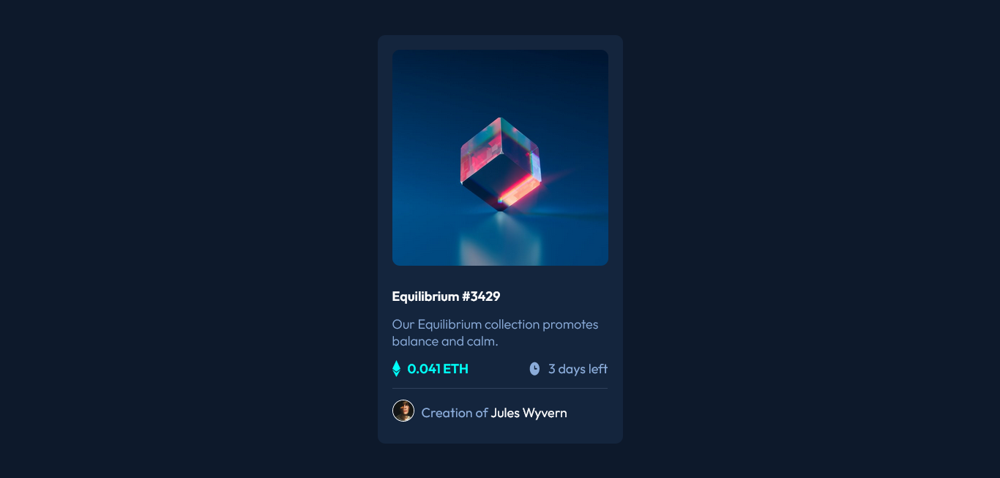

# Frontend Mentor - NFT preview card component solution

This is a solution to the [NFT preview card component challenge on Frontend Mentor](https://www.frontendmentor.io/challenges/nft-preview-card-component-SbdUL_w0U). Frontend Mentor challenges help you improve your coding skills by building realistic projects. 

## Table of contents

- [Overview](#overview)
  - [The challenge](#the-challenge)
  - [Screenshot](#screenshot)
  - [Links](#links)
- [My process](#my-process)
  - [Built with](#built-with)
  - [What I learned](#what-i-learned)
  - [Continued development](#continued-development)
  - [Useful resources](#useful-resources)
- [Author](#author)

## Overview

### The challenge

Users should be able to:

- View the optimal layout depending on their device's screen size
- See hover states for interactive elements

### Screenshot



### Links

- Solution URL: [Add solution URL here](https://your-solution-url.com)
- Live Site URL: [Add live site URL here](https://your-live-site-url.com)

## My process

### Built with

- Semantic HTML5 markup
- CSS custom properties
- Flexbox

### What I learned

How to put an overlay hover image, and how ro use the transition property.

```css
.overlay {
    position: relative;
    display: flex;
    align-items: center;
    justify-content: center;
    width: 100%;
    height: 100%;
    opacity: 0;
    transition: .5s ease;
    background-color: hsl(178, 100%, 50%);
    border-radius: 10px;
}
```

### Continued development

Use of CSS variables and JavaScript code.

### Useful resources

- [blog-preview-card](https://github.com/saulgutierrez/blog-preview-card-main) - This project are very similar to this one.
- [mdn web docs](https://developer.mozilla.org/en-US/docs/Web/CSS) - Documentation site and guides for HTML, CSS and JS.

## Author

- Website - [Saúl Gutiérrez](https://sauladai.netlify.app)
- Frontend Mentor - [@saulgutierrez](https://www.frontendmentor.io/profile/saulgutierrez)